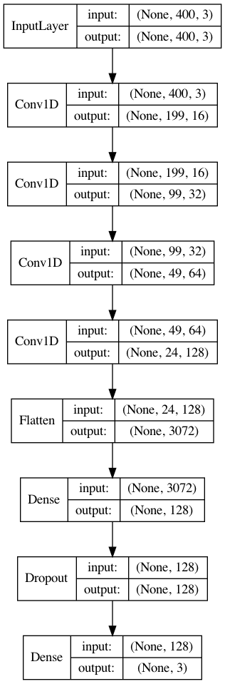

# MLCourseLab
 
## Anaconda Installation
Check website: https://docs.anaconda.com/anaconda/install/

Or  https://www.anaconda.com/products/individual to download Individual Edition (Python 3.7 version)

## Install Dependent Packages
Open termnial and type the following commands:
```
pip install obspy
pip install keras
pip install tensorflow
```
you can change to gpu version with command `pip install tensorflow-gpu` if you have CUDA and gpu.

## Instruction on Jupyter Lab

1) Open terminal (Linux/OS) and type `jupyter lab` or open Jupyter Notebook desktop launcher (Windows)
2) Change the path to the folder of MLCourseLab
3) Check the completeness. This folder should at least include two jupyter files: Neural_Network.ipynb and PhasePicking.ipynb. It also includes 3 data files: Continous_Waveforms.npz, Label.npy, and Waveform.npy. 
4) Get familiar with the JupyterLab Interface: https://jupyterlab.readthedocs.io/en/stable/user/interface.html

## Finish Two Labs: Neural_Network and PhasePicking
1) Finish exercises in Neural_Network.ipynb and PhasePicking.ipynb files. You can add code `plt.savefig('filename.png')` in Jupyter cells to save the output figure. Please save all the figures required in the exercises.
2) Write a report about neural network and convolutional neural network in pdf file ( ~ 5 pages). First, introduce neural network and convolutional neural network (you can reference slides and links provided in the lab). Second, please answer all the questions in the exercises with required figures and summary of models. Third, please write your understanding in building model structures (e.g., how many layers, how many nuerals, kernel size, strides). Finally, please give us some suggestions on this lab, so that we can keep improving and updating this lab.

## [Option] 
If you want to visualize a model like the following figure:


You need to install pydot and graphviz by using command `pip install pydot` and download graphviz through [link](http://www.graphviz.org/download/)

Then you can import plot_model module and plot the model structure.
```
from tensorflow.keras.utils import plot_model
plot_model(model, to_file='Fig/phase_model.png', show_shapes=True, show_layer_names=False)
```
